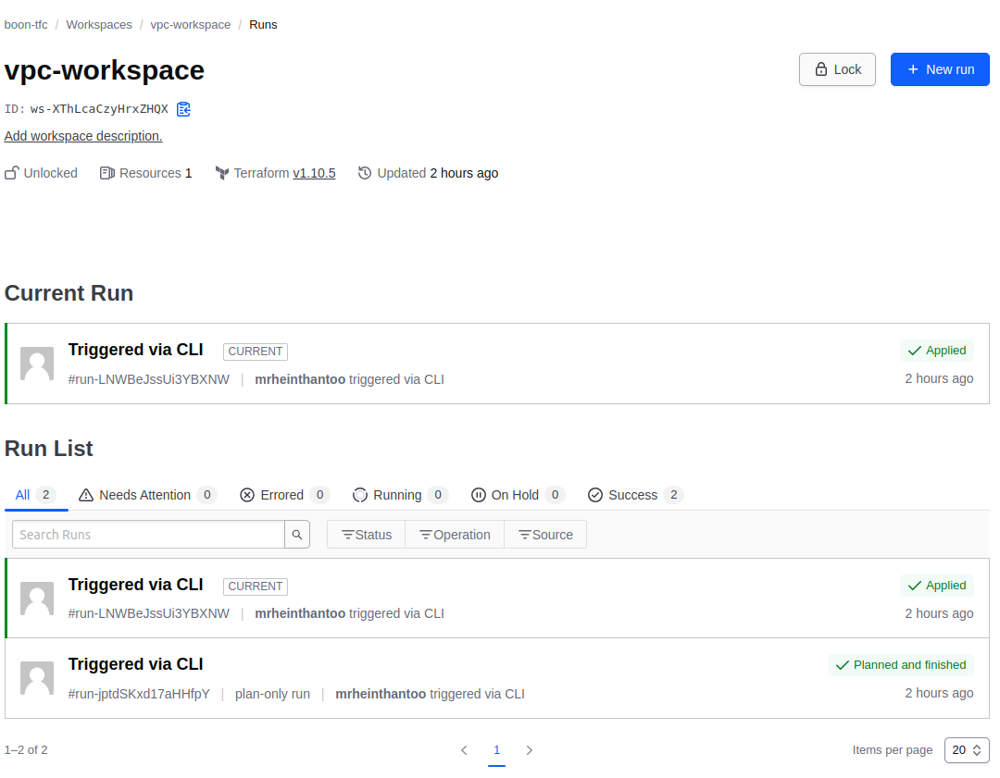
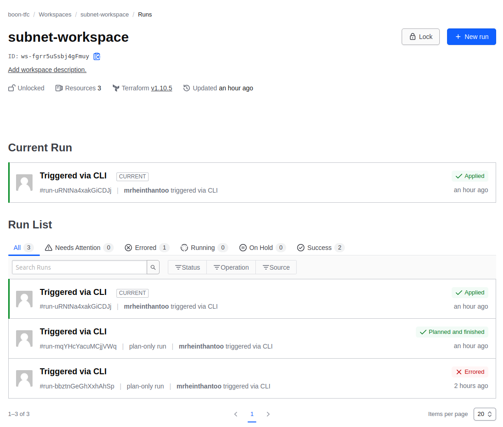

# Terraform Multi-Workspace Setup

This repository demonstrates how to use Terraform Cloud with multiple workspaces. We will create:

- **vpc-workspace**: Creates a VPC and outputs `vpc_id`.
- **subnet-workspace**: Uses `terraform_remote_state` to fetch `vpc_id` and create subnets.

## Prerequisites

Before you begin, ensure you have:

- Terraform CLI installed: [Download Terraform](https://developer.hashicorp.com/terraform/downloads)
- An AWS account with credentials configured
- Terraform Cloud account
- Workspaces `vpc-workspace` and `subnet-workspace` created in Terraform Cloud under the same organization

## Repository Structure

```
terraform-multi-workspace/
│── vpc-workspace/
│   ├── main.tf
│   ├── backend.tf
│   ├── versions.tf
│
│── subnet-workspace/
│   ├── main.tf
│   ├── backend.tf
│   ├── versions.tf
│
│── README.md
```

## Setup Instructions

### 1️⃣ Initialize and Apply `vpc-workspace`

```bash
cd vpc-workspace
terraform init
terraform apply -auto-approve
```


This will create a VPC and output the `vpc_id`.

### 2️⃣ Authorize `subnet-workspace` to Read `vpc-workspace` State

- **Go to Terraform Cloud** → Select `vpc-workspace`
- **Settings** → **State** → **Add "subnet-workspace" as an Authorized State Consumer**

### 3️⃣ Initialize and Apply `subnet-workspace`

```bash
cd ../subnet-workspace
terraform init
terraform apply -auto-approve
```


This will retrieve the `vpc_id` from `vpc-workspace` and create subnets inside the VPC.

## Terraform Configuration Details

### `vpc/main.tf` (Creates VPC)

```hcl
resource "aws_vpc" "sandbox-vpc" { #Create new custom vpc
  cidr_block           = "10.0.0.0/16"
  enable_dns_hostnames = true
  enable_dns_support   = true
  instance_tenancy     = "default"
  provider             = aws

  tags = {
    Name   = "sandbox-vpc"
  }
}

output "vpc_id" {
  value = aws_vpc.sandbox-vpc.id
}
```


### `subnet/main.tf` (Creates Subnets Using VPC ID from `vpc-workspace`)

```hcl
data "terraform_remote_state" "vpc" {
  backend = "remote"

  config = {
    organization = "boon-tfc"
    workspaces = {
      name = "vpc-workspace"  # This is the workspace name that holds the VPC ID
    }
  }
}

resource "aws_subnet" "publicSubnet1" { #Create new publicSubnet
  provider                       = aws
  vpc_id                         = data.terraform_remote_state.vpc.outputs.vpc_id
  cidr_block                     = "10.0.1.0/24"
  map_public_ip_on_launch        = true
  availability_zone              = "ap-southeast-1a"
  
  tags          = {
    Name        = "publicSubnet1"
    Env         = "Sandbox"
  }
}

resource "aws_subnet" "publicSubnet2" { #Create new publicSubnet
  provider                        = aws
  vpc_id                          = data.terraform_remote_state.vpc.outputs.vpc_id
  cidr_block                      = "10.0.2.0/24"
  map_public_ip_on_launch         = true
  availability_zone               = "ap-southeast-1b"

  tags          = {
    Name        = "publicSubnet2"
    Env         = "Sandbox"
  }
}


```

## Notes

- Ensure both workspaces belong to the **"boon-tfc"** organization in Terraform Cloud.
- Terraform Cloud is used as the backend for state management.
- Make sure to authorize state access between workspaces.

---

## Cleanup

To destroy all resources, run:

```bash
cd vpc
terraform destroy -auto-approve

cd ../subnet
terraform destroy -auto-approve
```

---

## Troubleshooting

1. **Error: "forbidden - Not authorized to read state"**

   - Ensure `subnet-workspace` is added as an authorized state consumer in Terraform Cloud.

2. **Workspaces not found**

   - Check if both workspaces exist in Terraform Cloud under `boon-tfc`.

3. **AWS Region Invalid**

   - Verify the region is correctly set in both `main.tf` files.

---

### Happy Terraforming! 🚀

